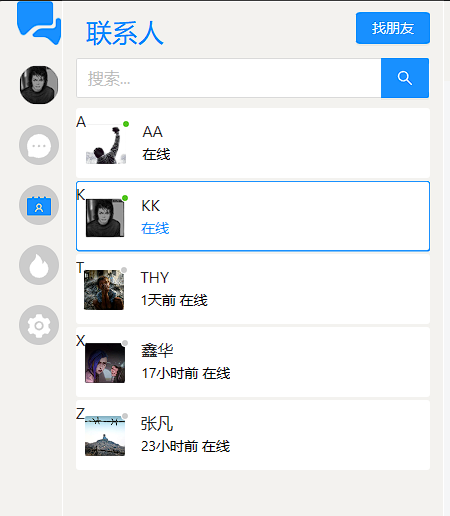
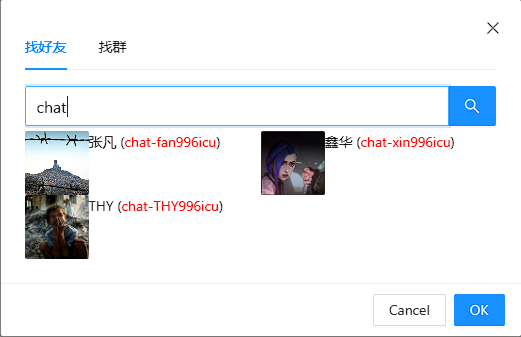
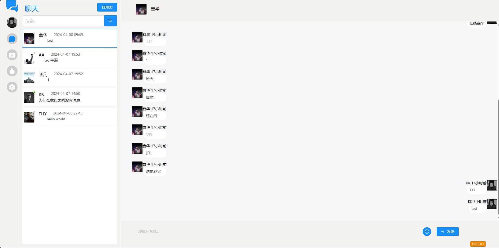
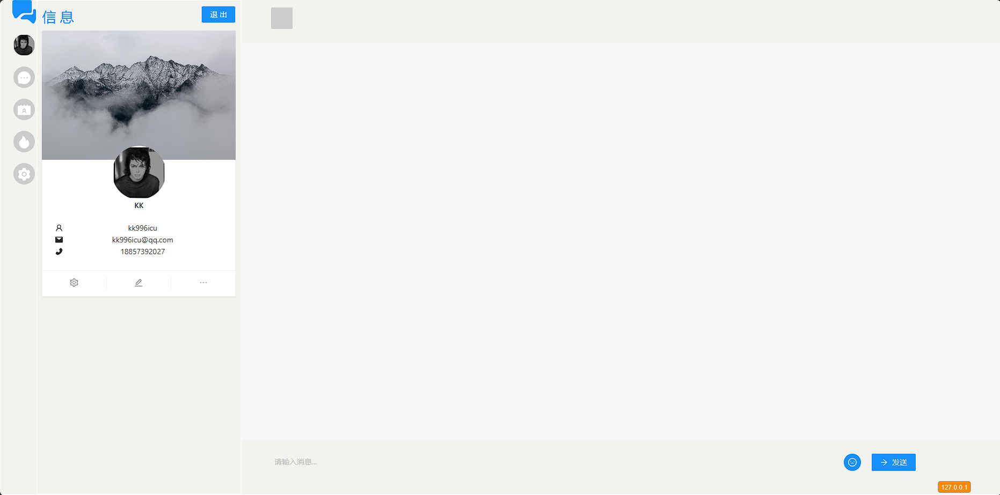

## KK-Chat

## 平台介绍
- 基于Gin Redis MongoDB MySQL  Vue TypeScript Ant-Design开发IM应用
- 有一些基本功能点 私聊 群聊 等基础功能点

### 使用技术
#### 后端
 -  mysql 做为数据存储
 - Redis 存储消息数据 和最近聊天列表
 - mongoDB 存储消息
 - gin web框架
 - websocket 保持长连接网页通讯
 
#### 前端
 - Vue 
 - ant-design
 - TS

#### 文件
- config 配置文件 ./mainifest/config/app.toml
- sql ./resource/sql/chat.sql
- 日志存储 ./resource/server/*
- 图片存储 ./resource/public/images/*
- 核心代码 ./internal/*

#### 功能列表
 - 登录 注册 (已完成)
 - 查找好友 (已完成)
 - 添加好友 (已完成)
 - 查询联系人 (已完成)
 - 查看最近聊天消息列表(已完成)
 - 查看历史消息 (已完成)
 - 发送消息(已完成)
 - 更改用户信息头像 (已完成)
 - 朋友圈 (未完成)
 - 设置 (未完成)

#### 效果图

